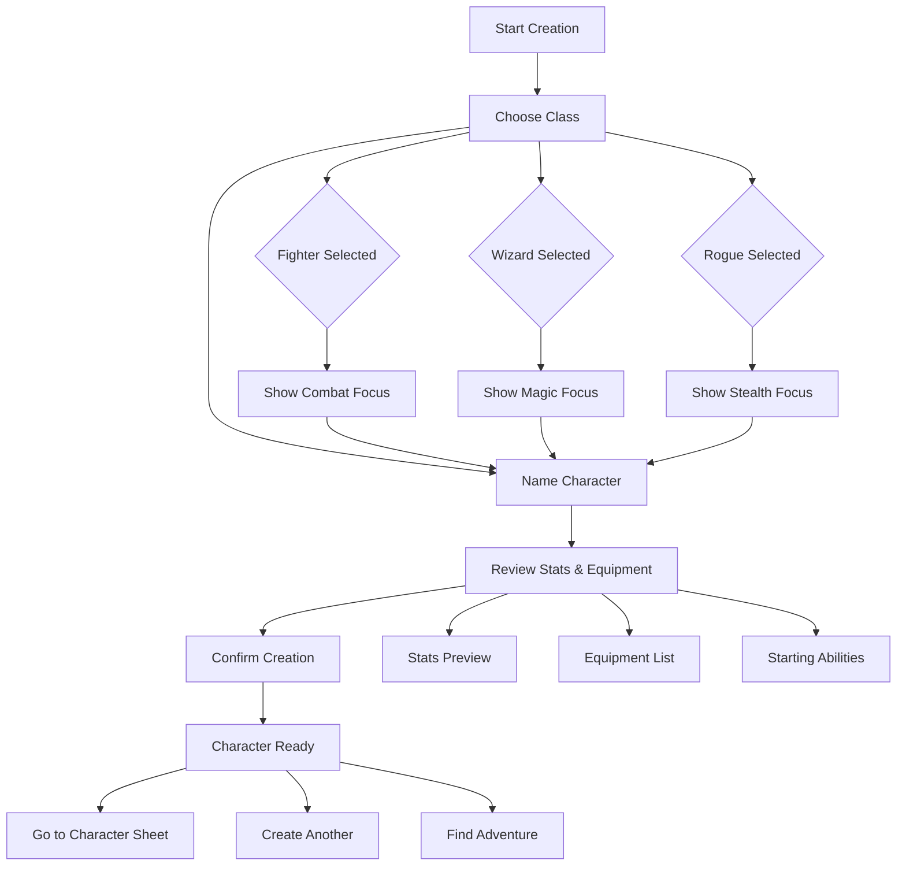
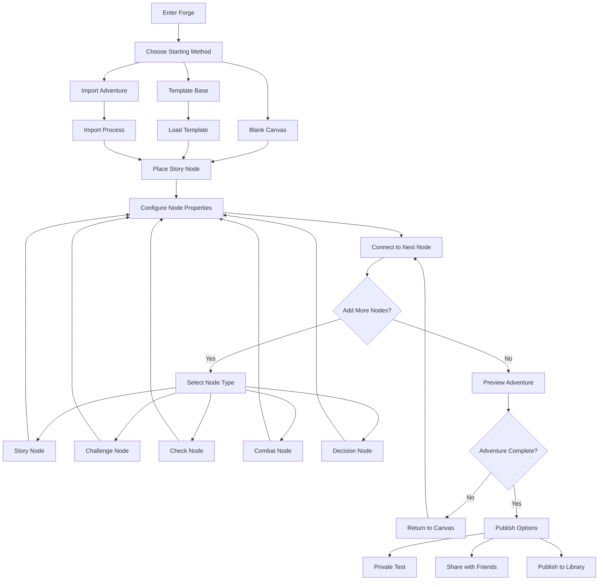
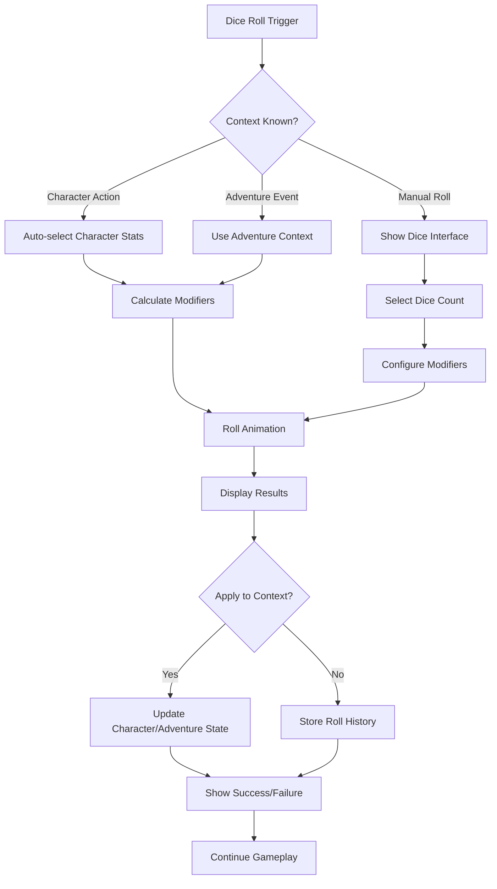

# SPARC RPG UI/UX Specification

This document defines the user experience goals, information architecture, user flows, and visual design specifications for SPARC RPG's user interface. It serves as the foundation for visual design and frontend development, ensuring a cohesive and user-centered experience.

## Overall UX Goals & Principles

### Target User Personas

**Players (Primary Users):**
- New players wanting quick character creation (under 5 minutes)
- Casual gamers seeking streamlined RPG experience without complexity
- Mobile-first users who game on-the-go
- Social players who want to share characters and adventures

**Seers/Game Masters (Power Users):**
- Experienced RPG runners needing comprehensive adventure management
- Creative storytellers who want visual adventure building tools
- Community managers sharing content through the Library
- Technical users comfortable with advanced features and detailed controls

### Usability Goals

- **Rapid onboarding:** New players can create a character and understand core mechanics within 5 minutes
- **Seamless switching:** Users can effortlessly transition between Player and Seer modes
- **Visual clarity:** Complex adventure structures are immediately comprehensible through node-based visualization
- **Mobile optimization:** Full functionality maintained across all device sizes with touch-first interactions
- **Performance excellence:** Sub-100ms dice rolling and real-time adventure building feedback

### Design Principles

1. **Metallic elegance over generic fantasy** - Leverage SPARC's distinctive orange-bronze metallic identity rather than typical fantasy tropes
2. **Simplicity with depth** - Present simple interfaces that reveal sophisticated functionality progressively
3. **Node-based thinking** - Use visual connection patterns consistently across adventure building, character relationships, and system interactions
4. **Dual-mode harmony** - Ensure seamless experience whether users are in Player or Seer mode
5. **Performance as feature** - Make speed and responsiveness core to the user experience, not just technical requirements

### Change Log

| Date | Version | Description | Author |
|------|---------|-------------|---------|
| 2025-09-05 | 1.0 | Initial comprehensive specification for full SPARC ecosystem | Sally (UX Expert) |

## Information Architecture (IA)

### Site Map / Screen Inventory

```mermaid
graph TD
    A[SPARC Hub] --> B[Dashboard]
    A --> C[Characters]
    A --> D[Adventures]
    A --> E[Forge - Adventure Builder]
    A --> F[Library]
    A --> G[Profile]
    
    B --> B1[Player Dashboard]
    B --> B2[Seer Dashboard]
    B --> B3[System Status]
    
    C --> C1[My Characters]
    C --> C2[Character Creation]
    C --> C3[Character Sheet]
    C --> C4[Character Equipment]
    
    D --> D1[Active Adventures]
    D --> D2[Adventure Browser]
    D --> D3[Adventure Session View]
    D --> D4[Adventure History]
    
    E --> E1[Canvas - Visual Builder]
    E --> E2[Node Library]
    E --> E3[Properties Panel]
    E --> E4[Adventure Preview]
    E --> E5[Publishing Tools]
    
    F --> F1[Public Adventures]
    F --> F2[Community Characters]
    F --> F3[Asset Repository]
    F --> F4[User Collections]
    
    G --> G1[User Settings]
    G --> G2[API Configuration]
    G --> G3[Seer Tools Access]
    G --> G4[Account Management]
```

### Navigation Structure

**Primary Navigation:** Top-level metallic bronze navigation bar with six main sections. Each section uses distinctive iconography (⚔️ Characters, 🎲 Adventures, 🔧 Forge, 📚 Library, 👤 Profile) with SPARC's signature orange highlighting for active states.

**Secondary Navigation:** Context-sensitive sidebar within each section. Characters section shows character list, Adventures shows active/available adventures, Forge displays node palette and tools.

**Breadcrumb Strategy:** Path-based breadcrumbs for deep navigation within Forge and complex adventure structures. Format: Section > Sub-area > Specific Item (e.g., "Forge > My Adventures > Dragon's Lair > Combat Node #3")

## User Flows

### Character Creation Flow

**User Goal:** Create a playable character in under 5 minutes with meaningful choices that don't overwhelm new players

**Entry Points:** Dashboard "Create Character" button, Characters section "+ New Character", direct link sharing

**Success Criteria:** Character is created, equipped, and ready for adventure play with clear understanding of abilities

#### Flow Diagram

#### Edge Cases & Error Handling:
- Invalid character name (profanity filter, length limits) - inline validation with suggestions
- Network interruption during creation - auto-save draft and resume option
- Duplicate character name - append number suffix automatically
- Class selection indecision - provide "Random" option with explanation of result

**Notes:** Flow optimized for mobile-first interaction with large touch targets and minimal text input required.

### Adventure Forge Building Flow

**User Goal:** Create complex, branching adventures using visual node-based interface with immediate preview capability

**Entry Points:** Forge section main canvas, "Duplicate Adventure" from Library, template selection

**Success Criteria:** Adventure is built, tested, and ready for play or publishing with clear narrative flow

#### Flow Diagram

#### Edge Cases & Error Handling:
- Orphaned nodes (no connections) - automatic detection with repair suggestions
- Circular logic loops - visual warning with path highlighting
- Missing required node properties - red outline with tooltip guidance
- Canvas performance with 100+ nodes - automatic grouping and zoom optimization
- Accidental deletion of connected nodes - undo stack with visual preview

**Notes:** Real-time collaboration support planned for Seer teams building adventures together.

### Dice Rolling Integration Flow

**User Goal:** Roll dice quickly within context of character actions or adventure events with tactile feedback

**Entry Points:** Character sheet action buttons, adventure event prompts, standalone dice roller, combat interface

**Success Criteria:** Dice results are generated, displayed clearly, and applied to relevant game context automatically

#### Flow Diagram

#### Edge Cases & Error Handling:
- Network timeout during roll - local generation with sync when reconnected
- Invalid modifier values - clamp to reasonable ranges with user notification
- Roll history overflow - automatic archiving of older rolls
- Animation performance issues - fallback to instant results on slower devices

**Notes:** All rolls use exclusively d6 dice with SPARC RPG mechanics. Physics simulation provides satisfying tactile feedback.

## Wireframes & Mockups

**Primary Design Files:** Adventure Forge visual references provided in PDF documentation with complete node-based interface examples

### Key Screen Layouts

#### SPARC Hub Dashboard

**Purpose:** Central navigation and status overview for both Players and Seers with mode-specific content

**Key Elements:**
- Metallic bronze header with SPARC logo and user avatar
- Six main navigation tiles with distinctive iconography
- Recent activity feed showing character updates, adventure completions, community highlights
- Quick action buttons for character creation, adventure joining, forge access
- System status indicator and mode toggle (Player/Seer)

**Interaction Notes:** Hover states reveal additional options, tile layout adapts to user preference (list vs grid), activity feed supports pull-to-refresh on mobile

**Design File Reference:** Based on established SPARC visual identity with dark background and orange accent highlighting

#### Adventure Forge Canvas

**Purpose:** Visual adventure building interface with node-based drag-and-drop functionality

**Key Elements:**
- Infinite canvas with grid snapping and zoom controls
- Left sidebar node palette with Story, Challenge, Check, Combat, Decision types
- Right panel properties editor for selected node configuration
- Top toolbar with save, preview, undo/redo, collaboration tools
- Bottom status bar showing node count, validation warnings, publish status

**Interaction Notes:** Multi-select support with rubber band selection, context menus for node operations, real-time connection drawing with smart routing

**Design File Reference:** Adventure Forge Part 2 & 4 PDFs showing complete interface layout and interaction patterns

#### Character Sheet Interface

**Purpose:** Comprehensive character management with equipment, stats, and action integration

**Key Elements:**
- Character portrait area with customization options
- Stats display using SPARC's simplified attribute system
- Equipment grid with drag-and-drop inventory management
- Action buttons integrated with dice rolling system
- Progress tracking for character advancement
- Social features for character sharing

**Interaction Notes:** Swipe gestures for mobile equipment management, long-press for item details, quick-roll buttons with haptic feedback

**Design File Reference:** Following SPARC style guide typography and spacing requirements

## Component Library / Design System

**Design System Approach:** Extend SPARC's existing brand identity into a comprehensive UI component system optimized for gaming interfaces with accessibility and performance prioritized

### Core Components

#### Metallic Button System

**Purpose:** Primary interactive elements reflecting SPARC's metallic bronze brand identity

**Variants:** Primary (orange gradient), Secondary (bronze outline), Destructive (red accent), Success (green accent)

**States:** Default, Hover (subtle glow), Active (pressed inset), Disabled (reduced opacity), Loading (animated shimmer)

**Usage Guidelines:** Use Primary for main actions, Secondary for navigation, maintain 44px minimum touch targets, ensure 4.5:1 contrast ratio minimum

#### Node Interface Components

**Purpose:** Specialized components for Adventure Forge visual building system

**Variants:** Story Node (blue), Challenge Node (orange), Check Node (green), Combat Node (red), Decision Node (purple)

**States:** Default, Selected (orange outline), Connected (subtle highlight), Error (red border), Dragging (elevated shadow)

**Usage Guidelines:** Consistent 120px width, rounded corners with 8px radius, connection points clearly marked, color-blind accessible patterns

#### Dice Interface Elements

**Purpose:** Tactile dice rolling components with physics simulation and clear result display

**Variants:** Single die, Multiple dice, Result summary, Roll history item

**States:** Ready (static), Rolling (animated), Result (highlighted), Historical (subdued)

**Usage Guidelines:** Maintain d6 cubic appearance, use satisfying animation curves, display results with high contrast, provide skip animation option

## Branding & Style Guide

### Visual Identity

**Brand Guidelines:** SPARC Style Guide PDF provides comprehensive brand standards including logo usage, color specifications, and typography hierarchy

### Color Palette

| Color Type | Hex Code | Usage |
|------------|----------|--------|
| Primary | #CC7A00 | Main brand orange, primary buttons, active states, highlighting |
| Secondary | #8B4513 | Bronze metallic accents, secondary buttons, borders |
| Accent | #FFB347 | Light orange for hover states, success indicators |
| Success | #4CAF50 | Positive feedback, confirmations, successful rolls |
| Warning | #FF9800 | Cautions, important notices, validation warnings |
| Error | #F44336 | Errors, destructive actions, failed rolls |
| Neutral | #2C2C2C, #404040, #757575, #BDBDBD | Text hierarchy, borders, backgrounds, disabled states |

### Typography

#### Font Families
- **Primary:** Friz Quadrata (headings, display text, brand elements)
- **Secondary:** Gotham (body text, UI labels, buttons)  
- **Monospace:** JetBrains Mono (code, technical data, dice results)

#### Type Scale

| Element | Size | Weight | Line Height |
|---------|------|--------|-------------|
| H1 | 48px | Bold | 1.2 |
| H2 | 36px | Bold | 1.3 |
| H3 | 24px | Medium | 1.4 |
| Body | 16px | Regular | 1.5 |
| Small | 14px | Regular | 1.4 |

### Iconography

**Icon Library:** Custom SPARC iconography combining fantasy RPG elements with modern interface standards

**Usage Guidelines:** 24px standard size, 16px for compact interfaces, maintain consistent stroke width, use orange accent for active states

### Spacing & Layout

**Grid System:** 8px base unit with 24px columns, responsive breakpoints at 768px (tablet) and 1024px (desktop)

**Spacing Scale:** 8px, 16px, 24px, 32px, 48px, 64px progression for consistent rhythm throughout interface

## Accessibility Requirements

### Compliance Target

**Standard:** WCAG 2.1 AA compliance with specific enhancements for gaming interfaces and complex visual interactions

### Key Requirements

**Visual:**
- Color contrast ratios: 4.5:1 minimum for standard text, 3:1 for large text, 4.5:1 for UI components
- Focus indicators: 2px orange outline with 2px offset, clearly visible on all interactive elements
- Text sizing: Support 200% zoom without horizontal scrolling, scalable fonts throughout

**Interaction:**
- Keyboard navigation: Full tab order support, arrow key navigation in node canvas, Enter/Space activation
- Screen reader support: Comprehensive ARIA labels, live regions for dice results, semantic HTML structure
- Touch targets: 44px minimum size, adequate spacing between interactive elements, gesture alternatives

**Content:**
- Alternative text: Descriptive alt text for all character portraits, adventure images, and decorative elements
- Heading structure: Logical H1-H6 hierarchy, proper sectioning, landmark roles
- Form labels: Explicit labels for all inputs, error messages clearly associated, validation feedback

### Testing Strategy

Combination of automated testing (axe-core integration), manual keyboard navigation testing, screen reader verification (NVDA/JAWS), and mobile accessibility validation across iOS VoiceOver and Android TalkBack

## Responsiveness Strategy

### Breakpoints

| Breakpoint | Min Width | Max Width | Target Devices |
|------------|-----------|-----------|----------------|
| Mobile | 320px | 767px | Phones, small tablets in portrait |
| Tablet | 768px | 1023px | Tablets, small laptops |
| Desktop | 1024px | 1439px | Standard desktops, laptops |
| Wide | 1440px | - | Large monitors, ultra-wide displays |

### Adaptation Patterns

**Layout Changes:** Single column mobile with stacked cards, two-column tablet with sidebar, three-column desktop with panel layout. Adventure Forge uses full-screen mobile mode with floating toolbars.

**Navigation Changes:** Collapsed hamburger menu on mobile with full-screen overlay, persistent sidebar on tablet/desktop, contextual action bars adapt to available space.

**Content Priority:** Character essentials prioritized on mobile (stats, quick actions), full detail panels available on larger screens, progressive disclosure patterns throughout.

**Interaction Changes:** Touch-first design with swipe gestures, hover states for desktop enhancement, long-press alternatives for right-click functionality, pinch-zoom support in Forge canvas.

## Animation & Micro-interactions

### Motion Principles

Animations serve functional purposes: dice rolling provides tactile feedback, node connections show relationship building, state changes communicate system response. Motion follows SPARC's metallic theme with subtle shimmer effects and bronze-tinted transitions.

### Key Animations

- **Dice Roll Animation:** Physics-based tumbling with 800ms duration, eased deceleration curve, satisfying impact feedback
- **Node Connection:** Smooth bezier curve drawing, 300ms duration, anticipation and follow-through easing
- **Page Transitions:** Slide transitions with 250ms duration, subtle parallax effect, maintains visual continuity
- **Button Interactions:** Hover glow with 150ms fade-in, pressed state with 100ms spring animation, loading shimmer effect
- **Character Creation:** Progressive reveal of options, 400ms staggered animations, celebration micro-animation on completion

## Performance Considerations

### Performance Goals

- **Page Load:** 2 seconds initial load, 1 second subsequent navigation, progressive loading for adventure canvas
- **Interaction Response:** Sub-100ms for dice rolls, 16ms frame rate maintenance, immediate feedback for all inputs
- **Animation FPS:** Consistent 60fps for all animations, graceful degradation on slower devices, battery-conscious mobile optimization

### Design Strategies

Lazy loading for adventure thumbnails and character portraits, virtualized scrolling for large lists, optimized image formats (WebP/AVIF), component-level code splitting, efficient re-rendering through React optimization patterns, local storage for draft states and user preferences.

## Advanced Adventure Forge Specifications

### Comprehensive Node-Based Architecture

Based on the complete Adventure Forge interface documentation, the visual adventure builder represents a sophisticated node-based authoring system with the following advanced capabilities:

#### Node Type Specifications

**Story Elements (Blue Circle Icons)**
- Purpose: Narrative progression and world-building
- Properties: Rich text editor with formatting toolbar, image upload with "Hide from players" option
- Connections: Single output to any node type
- Validation: Must have content and valid connections

**Decision Elements (Purple Branching Icons)**  
- Purpose: Player choice and narrative branching
- Properties: Multiple decision branches with descriptions
- Connections: Each decision can link to new or existing elements
- Advanced Features: Unlimited decision options with dynamic addition
- Validation: Must have at least two decision branches

**Challenge Elements (Yellow Circle Icons)**
- Purpose: Skill-based tests with statistical requirements
- Properties: Stat selection (STR, DEX, INT, CHA), difficulty thresholds
- Outcome Types: Simple (pass/fail) or Complex (multiple roll ranges)
- Roll Configuration: Minimum/Maximum roll requirements for different outcomes
- Connections: Success and failure paths to different elements

**Combat Elements (Red X Icons)**
- Purpose: Monster encounters and tactical challenges
- Properties: Creature selection from library, quantity configuration
- Quantity Options: Static numbers or dynamic "per player + modifier" scaling
- Creature Integration: Links to central creature database with stats
- Outcome Management: Multiple result paths based on combat resolution

**Check Elements (Green Icons)**
- Purpose: Simple pass/fail mechanics without complex rolling
- Properties: Basic success/failure conditions
- Usage: Environmental challenges, automatic story progression
- Connections: Binary success/fail routing

#### Canvas Management System

**Infinite Canvas Architecture**
- Grid-based positioning with snap-to-grid functionality
- Smooth pan and zoom with touch gesture support
- Multi-device responsiveness from desktop to mobile
- Visual grid indicators for alignment assistance

**Connection System**
- Smart bezier curve routing between nodes
- Drag-and-drop connection creation
- Visual feedback during connection attempts
- Automatic path optimization to avoid overlaps
- Color-coded connections based on relationship types

**Selection and Manipulation**
- Rubber band multi-selection with Ctrl/Cmd key support
- Group operations: copy, cut, paste, delete
- Context menus for quick actions
- Keyboard shortcuts for power users
- Visual grouping with labeled containers (e.g., "Chapter 1: Get Quest")

#### Advanced Validation Framework

**Real-Time Error Detection**
- Missing victory screen connections
- Missing failure screen connections  
- Orphaned elements with no paths to resolution
- Incomplete node configurations
- Circular dependency detection

**Warning Dialog System**
- Comprehensive error descriptions with suggested fixes
- Color-coded severity levels (warnings vs. critical errors)  
- One-click resolution for common issues
- Contextual help with examples

**Publication Requirements**
- All critical errors must be resolved before publishing
- Adventure length estimation and display
- Playtime calculation based on node complexity
- Automated testing suggestions

#### Mobile-First Responsive Design

**Touch Optimization**
- 44px minimum touch targets throughout interface
- Gesture-based navigation (pinch-to-zoom, pan)
- Floating action buttons for common operations
- Collapsible panels to maximize canvas space

**Adaptive Interface**
- Elements panel transforms to bottom sheet on mobile
- Properties panel becomes modal overlay
- Toolbar condenses to essential actions
- Canvas controls optimize for thumb accessibility

**Cross-Device Continuity**
- Real-time synchronization across devices
- Draft auto-save with conflict resolution
- Responsive breakpoints maintain functionality
- Progressive enhancement for advanced features

### Platform Integration Architecture

#### Content Management Integration

**Library System Connection**
- Seamless access to creature database during combat node creation
- Item repository integration for reward specification
- Template system for adventure starting points
- Community content sharing and discovery

**Account Management Integration**
- Access code system for premium content and templates
- Achievement system integration with adventure creation milestones
- User profile management with creation statistics
- Social features for adventure sharing and collaboration

**Version Control System**
- Draft and published state management
- Timestamp tracking for all modifications
- Rollback capabilities for major changes
- Collaborative editing with conflict resolution

#### Quality Assurance Pipeline

**Automated Testing Integration**
- Adventure flow validation before publication
- Playtesting simulation for balance checking
- Content moderation for community guidelines
- Performance optimization for complex adventures

**Analytics Integration**  
- Node usage statistics for design optimization
- User behavior tracking for UX improvements
- Popular template identification
- Community engagement metrics

## Next Steps

### Immediate Actions

1. **Adventure Forge Prototype Development**: Create interactive prototype focusing on node manipulation and connection system
2. **Validation System Implementation**: Develop comprehensive error detection and user guidance framework  
3. **Mobile Touch Interface Testing**: Validate gesture-based interactions across device sizes
4. **Integration Architecture Planning**: Design API requirements for library, account, and content management systems
5. **Accessibility Audit**: Ensure node-based interface meets WCAG standards with alternative interaction methods

### Design Handoff Checklist

- [x] All user flows documented with Adventure Forge complexity
- [x] Component inventory complete including node-based systems  
- [x] Accessibility requirements defined for visual editor interface
- [x] Responsive strategy clear with mobile-first approach
- [x] Brand guidelines incorporated with SPARC metallic identity
- [x] Performance goals established for complex canvas operations
- [x] Advanced validation framework specified
- [x] Cross-platform integration architecture defined

## Comprehensive Ecosystem Summary

This enhanced UI/UX specification now covers the complete SPARC RPG ecosystem including the sophisticated Adventure Forge visual authoring system. The specification integrates:

- **Dual-audience design** supporting both casual Players and power-user Seers
- **Node-based visual authoring** with comprehensive validation and error handling
- **Cross-device responsive experience** from mobile-first to desktop power-user workflows  
- **Integrated content management** connecting adventures, characters, creatures, and items
- **Community features** enabling sharing, discovery, and collaborative creation
- **Advanced accessibility** ensuring inclusive design across complex visual interfaces
- **Performance optimization** for real-time collaborative editing and complex adventure structures

The design framework provides a complete blueprint for implementing a professional-grade RPG content creation and management platform that scales from individual creators to large gaming communities.